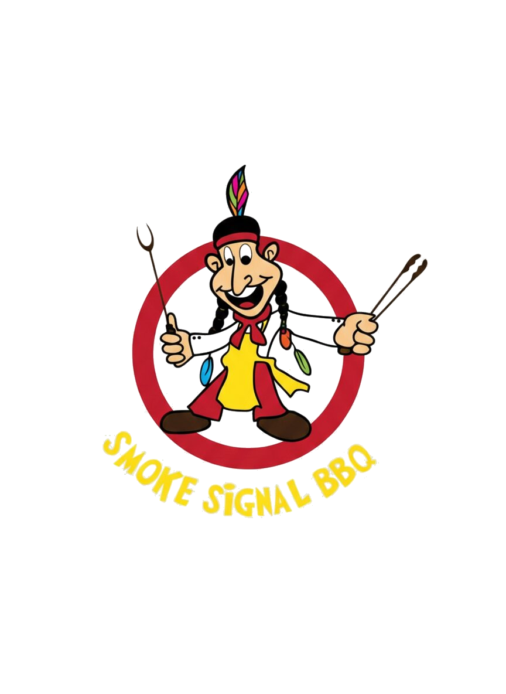

# Smoke Signal BBQ 🍖🔥

**The Ultimate Full-Stack Pitmaster Platform** | Bangalore's Original Texas BBQ since 2011.



## 📖 Overview
Smoke Signal BBQ is a comprehensive full-stack digital ecosystem designed for Bangalore's premier authentic BBQ brand. It handles everything from customer-facing storytelling and e-commerce to backend administration, event lead management, and specialized combo pack engineering.

---

## 🏗️ Architecture
The platform is built as a cohesive monorepo-style application:

1.  **Customer Web App (`/`)**: A high-performance marketing and e-commerce site focused on visual storytelling and seamless ordering. Built with React.
2.  **Admin Dashboard (`/admin`)**: A specialized Next.js environment for managing inventory, combos, event inquiries, and business analytics.
3.  **Backend API (`/backend`)**: A robust Node.js/Express service powered by Prisma and PostgreSQL, handling the core business logic and data persistence.

---

## ✨ Features Breakdown

### 🎯 Customer Frontend
-   **Immersive Home Page**: Hero storytelling, live-fire aesthetics, and "How it Works" visuals.
-   **Dynamic Shop**: Real-time product fetching with category filtering and persistent "Quick Add" cart.
-   **Pitmaster Combos**: Specialized bundle showcase with "Most Popular" and "Best Value" highlighting.
-   **Event Quote System**: Lead generation form for private/corporate events with automated **WhatsApp Integration**.
-   **Blog Platform**: Narrative-driven content focused on BBQ culture and pitmaster secrets.
-   **Engagement Tools**: Offers Popups and Abandoned Cart recovery systems.
-   **SEO Optimized**: Dynamic metadata, sitemap generation, and robots.txt.

### 🛠️ Admin Dashboard
-   **Unified Inventory**: Integrated management table for both individual products and combo packs.
-   **Combo Pack Engineer**: Specialized tool to bundle products, set dynamic prices, and toggle marketing highlights.
-   **Event Lead Manager**: Real-time tracking and status management for catering and private event inquiries.
-   **Blog Editor**: Full CRUD interface for creating and publishing BBQ-related content.
-   **Order Tracking**: Oversight of customer orders and payment statuses (Initial structure).
-   **User Management**: Role-based access for staff and administrators.

### ⚙️ Backend & Database
-   **RESTful API**: Clean `/api/v1` architecture with protected routes.
-   **Prisma ORM**: Type-safe database interactions with PostgreSQL.
-   **Auth Services**: Secure login and session management for administrative tasks.
-   **Performance**: Optimized queries for parallel fetching of products and combos.

---

## 🛠️ Tech Stack

-   **Frontend Client**: React + TypeScript + Vite + Tailwind CSS + Framer Motion.
-   **Admin Panel**: Next.js + Lucide + Radix UI + Tailwind.
-   **Backend Core**: Node.js + Express.
-   **Database**: PostgreSQL + Prisma ORM.
-   **State Management**: Zustand (Cart & Auth).
-   **Communication**: Axios for API integration.

---

## 🚀 Status & Roadmap

### ✅ Completed
- [x] Full-stack architecture setup.
- [x] Core e-commerce engine (Shop/Cart/Combos).
- [x] Admin Dashboard infrastructure & Sidebar.
- [x] Lead Generation system for Events & Inquiries tracking.
- [x] Dynamic Badge/Flag management for products/combos.
- [x] Monorepo build scripts & deployment configurations.
- [x] SEO Improvements & Marketing Popups.
- [x] Blog system architecture (Frontend + Admin).

### 🚧 In Progress / Remaining
- [ ] **Payment Gateway**: Integration with Razorpay/Stripe for direct web payments.
- [ ] **Live Order Tracking**: Customer-facing real-time status updates.
- [ ] **Analytics Suite**: Full visual charts for sales and inquiries in the admin panel.
- [ ] **Media Library**: Dedicated image management system for easy uploads.
- [ ] **Customer Accounts**: Loyalty profiles and persistent order history.

---

## 🛠️ Getting Started

### Prerequisites
- Node.js (v18+)
- PostgreSQL Instance

### Local Setup
1. **Clone & Install**:
   ```bash
   npm install
   cd admin && npm install
   cd ../backend && npm install
   ```
2. **Database Sync**:
   Set `DATABASE_URL` in `backend/.env` and run:
   ```bash
   cd backend
   npx prisma generate
   npx prisma db push
   ```
3. **Environment**:
   Configure `VITE_API_URL` in your `.env` to point to `http://localhost:5000/api/v1`.

4. **Run**:
   - Backend: `npm run dev` (inside /backend)
   - Frontend: `npm run dev` (root)
   - Admin: `npm run dev` (inside /admin)

---

## 🎨 Design System
- **Colors**: Fire Red (`#EF4444`), Charcoal (`#0B0B0B`), Fire Orange (`#FF6B00`).
- **Typography**: Rye (Serif) for headings, Montserrat (Sans) for body.
- **Aesthetic**: Texas Smokehouse, Vintage Red, Premium Dark Mode.

---

© 2026 Smoke Signal BBQ. Authentic Slow-Smoked Excellence.
